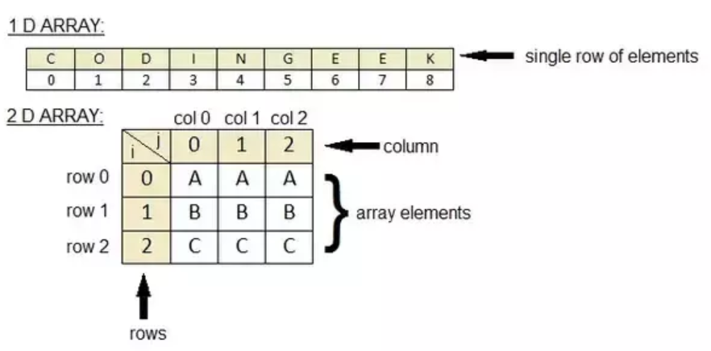
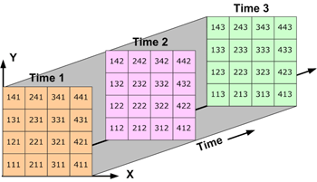
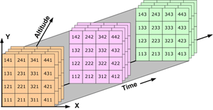

## What is NetCDF?
These lessons work with raster or “gridded” data that are stored as a uniform grid of values using the netCDF file format. This is the most common data format and file type in the atmospheric and ocean sciences; essentially all output from weather, climate and ocean models is gridded data stored as a series of netCDF files. Satellite data is also often provided in NetCDF format.    
  
Network Common Data Form (NetCDF) files are in binary format that are platform independent and self-describing (files contain a header and file metadata in the form of name/value attributes). This file format was developed by the Unidata project at the University Corporation for Atmospheric Research (UCAR).  
  
### Advantages
* One of the major advantages is that it is self describing, i.e. the metadata is stored within the file.  
* It is a binary format, which are more efficient. In terms of memory, storing values using numeric formats such as IEEE 754, rather than as text characters, tends to use less memory. In addition, binary formats also offer advantages in terms of speed of access. Easy to use, compact, machine independent.  
  
  
## Storage of NetCDF data
The data in a netCDF file is **stored in the form of arrays**. The data stored in an array needs to be of the same type (homogeneous). 
  
Temperature varying over time at a location is stored as a **one-dimensional array**. You can think of it as a list containing elements of the same data type (i.e. integers, floats).    
  
An example of a **2-dimensional array** is temperature over an area for a given time. A Pandas DataFrame is also a 2-dimensional data structure, but it differs from an array: a DataFrame can store hetergenous data elements, and you can access it as a table (using the columnnames and rows).  
  
  
  
**Three-dimensional (3D) data**, like temperature over an area varying with time. Think of this as a Pandas DataFrame where the "columns" (variables) have more than one dimension.  
  
  
**Four-dimensional (4D) data**, like temperature over a volume (lat, lon, altitude) varying with time, is stored as a series of three-dimensional arrays.  
  
  
## Basic components of a NetCDF file
A netCDF file contains **dimensions, variables, and attributes**. These components are used together to capture the meaning of data and relations among data fields in an array-oriented dataset. The following figure shows the structure of a netCDF file using the CDL (network Common Data form Language) notation. CDL is the ASCII format used to describe the content of a NetCDF file.  
  
  
  
  
### Dimensions
A NetCDF dimension is a named integer used to **specify the shape** of one or more of the multi-dimensional variables contained in a netCDF file. A dimension may be used to represent a real physical dimension, for example, time, latitude, longitude, or height; or more abstract quantities like station or model-run ID.  
  
Every NetCDF dimension has **both a name and a size**.  
* A dimension name is an arbitrary sequence of alphanumeric characters (as well as the underscore character, `_`, and the hyphen character, `-`) beginning with a letter. Case is distinguished in netCDF names. 
* A dimension size is an arbitrary positive integer, except that one dimension in a netCDF file can have the size UNLIMITED. Such a dimension is called the unlimited dimension or the record dimension. A variable with an unlimited dimension can grow to any length along that dimension.     

### Variables
A variable represents an **array of values of the same type**. Variables are used to store the bulk of the data in a netCDF file. 
A variable has a **name, data type, and shape** described by its list of dimensions specified when the variable is created. The number of dimensions is the rank (also known as dimensionality). A scalar variable has a rank of 0, a vector has a rank of 1, and a matrix has a rank of 2. 
A variable can also have associated attributes that can be added, deleted, or changed after the variable is created.  
Examples of variables are: temperature, salinity, oxygen, etc.

### Coordinate variables
A one-dimensional variable with the same name as a dimension is a coordinate variable. It is associated with a dimension of one or more data variables and typically defines a physical coordinate corresponding to that dimension. 2D coordinate fiels will not be defined as dimensions.

Coordinate variables have no special meaning to the netCDF library. However, the software using this library should handle coordinate variables in a specialized way.

### Attributes
NetCDF attributes are used to store ancillary data or metadata. Most attributes provide information about a specific variable. These attributes are identified by the name of the variable together with the name of the attribute.

Attributes that provide information about the entire netCDF file are global attributes. These attributes are identified by the attribute name together with a blank variable name (in CDL) or a special null variable ID (in C or Fortran).

## What tools to use NetCDF with
Setting up a Notebook and loading NetCDF data using Python libraries is not the only way of accessing these data. Other tools are:

### Command Line Interfaces
* Ncdump: Ncdump is the netCDF file reader that is bundled with Unidata's netCDF product. To obtain it, visit the UCAR Unidata Web site.
* NetCDF Operators (NCO): The NCO are a suite of programs known as operators in which each operator is a standalone, command line program which is executed at the UNIX command prompt. To learn more and to download the operators, visit the NCO Hompage.  
* Climate data operators (CDO - https://code.mpimet.mpg.de/projects/cdo), also a collection of command-line operators to manipulate and analyze NetCDf data. It is not as popular as NCO, but still used. 

### GUI Interfaces
* Ncview: Ncview is a netCDF visual browser that allows the user to visually inspect NetCDF data files. To download ncview, visit David Pierce's Ncview Web page.
* IDL NetCDF Reader: For users who are familiar with IDL, David Fanning has created a netCDF browser in IDL: ncdf_browser.pro. To download this procedure, visit the NCDF Browser section of David Fanning's Web site.
* Panoply: Panoply is a JAVA application developed by NASA for viewing netCDF files. For more information and to download a copy, visit NASA's Panoply netCDF Viewer Web page.
* NcBrowse: NcBrowse is a Java application that offers flexible, interactive graphical displays of data and its attributes from a wide range of netCDF data file conventions. For more information and to download a copy, visit NcBrowse: A Graphical NetCDF File Browser Web site

## CMIP data

This is the dataset that we will be using for our class and is very known and widely used by oceanographers. The dataset is regular, linear, gridded data. It represents the mean monthly prescipitation flux (kg m-2 s-1) on a global scale. 

CMIP (Coupled Model Intercomparison Project) provides a community-based infrastructure in support of climate model diagnosis, validation, intercomparison, documentation and data access. This framework enables a diverse community of scientists to analyze GCMs in a systematic fashion, a process which serves to facilitate model improvement.

The acronym GCM originally stood for General Circulation Model. Recently, a second meaning came into use, namely Global Climate Model. While these do not refer to the same thing, General Circulation Models are typically the tools used for modelling climate, and hence the two terms are sometimes used interchangeably. However, the term "global climate model" is ambiguous and may refer to an integrated framework that incorporates multiple components including a general circulation model, or may refer to the general class of climate models that use a variety of means to represent the climate mathematically. 

## Python Libraries
There are 2 main libraries that are being used in Python to work with NetCDF data: **xarray and iris**. In this course we will use xarray, this library took the pandas concept and extended it to gridded data. Working with this package in Python is similar to the concepts and ideas as the Pandas library for tabular data. The Iris library has a more unique syntax. 
  
The  cartopy library is the package used to plot our data, it is designed for geospatial data processing in order to produce maps and other geospatial data analyses. 
  
    
#### Sources: 
CMIP5 Database: https://esgf-node.llnl.gov/projects/cmip5/  
CMIP5 datastructure: https://portal.enes.org/data/enes-model-data/cmip5/datastructure  
Tools: https://nsidc.org/data/netcdf/tools.html  
Explanation file name: https://scienceofdoom.com/2020/05/16/extracting-rainfall-data-from-cmip5-models/  
Terminology: http://cfconventions.org/Data/cf-conventions/cf-conventions-1.7/cf-conventions.html#terminology  

