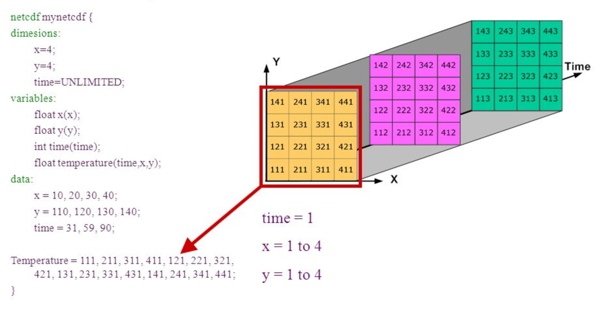

## Takeaways

### Spreadsheets

* Never modify your raw data. Always make a copy before making any changes.  
* Keep track of all of the steps you take to clean your data in a plain text file.  
* Organize your data according to tidy data principles. The main takeaway here is that **data should be both human and machine readable**: Avoid using multiple tables within one spreadsheet, avoid spreading data across multiple tabs, record zeros as zeros,
use an appropriate null value to record missing data, don’t use formatting to convey information or to make your spreadsheet look pretty, place comments in a separate column,
record units in column headers, include only one piece of information in a cell, avoid spaces, numbers and special characters in column headers, avoid special characters in your data, record metadata in a separate plain text file. Store dates as strings preferibly in the ISO 8601 format. Export your table to a csv.  

  
### Python
One can assign a value to a **variable** in Python. Those variables can be of several types, such as string, integer, floating point and complex numbers.  
  
Python Data structures:  
 * **list**: `another_list = ["blue", "green", "red"]` - Lists contains an ordered sequence of elements. Each element can be accessed by an index. 
 * tuple: `another_tuple = ("blue", "green", "red")` - Tuples are order lists of elements, but immutable
 * Dictionary: `another_dict = {'first': 'one', 'second': 'two', 'third': 'three'}` - Dictionaries are data structures that provide mappings between keys and values
 
Python uses **0-based indexing**, in which the first element in a list, tuple or any other data structure has an index of 0. 
 
Libraries enable us to extend the functionality of Python.  

### Pandas
One of the best options for **working with tabular data** in Python is the library Pandas (Python Data Analysis Library).  
  
Pandas provides an object called DataFrame, this object represents tabular data. Dataframes are a **2-dimensional data structure and can store data of different types** (including characters, integers, floating point values, factors and more) in columns.  
  
Aggregating data using the `groupby()` function enables you to generate useful summaries of data quickly.  
  
Dataframes can be subsetted in different ways including using labels (column headings), numeric ranges, or specific x,y index locations.  
* dataframe["column_name"]
* dataframe.column_name
* dataframe[['column_name1','column_name2']]
* dataframe[0:3]

Subset rows and columns with .loc() and .iloc.
* loc is primarily label based indexing. Integers may be used but they are interpreted as a label.
* iloc is primarily integer based indexing

Data from multiple files can be combined into a single DataFrame using merge and concat.

Create a true copy of a data frame with .copy().
* true_copy_surveys_df = surveys_df.copy()

Using the '=' operator creates another variable that references the same data frame.
* ref_surveys_df = surveys_df

A mask can be useful subset your dataframe based on a specific condition like where x > 5 or x is a null value.
* `pd.isnull(dataframe)` will produce a dataframe with True or False values (Boolean).
* dataframe[pd.isnull(dataframe).any(axis=1)]  will apply a mask to a dataframe

### Plotting
Matplotlib is a Python package that is widely used throughout the scientific Python community to create high-quality and publication-ready graphics.  
  
Useful resources:  
* Matplotlib gallery: https://matplotlib.org/gallery.html  
* The PyViz.org website is an open platform for helping users decide on the best open-source (OSS) Python data visualization tools for their purposes, with links, overviews, comparisons, and examples.”  

The plotnine package is built on top of Matplotlib and interacts well with Pandas, it supports the creation of complex plots from data in a dataframe. Plotnine graphics are built step by step by adding new elements adding different elements on top of each other using the + operator. Putting the individual steps together in brackets () provides Python-compatible syntax.

## Setting up your Anaconda environment
Python is a popular language for research computing, and great for general-purpose programming as well. Installing all of its research packages individually can be a bit difficult, so we recommend **Anaconda, an all-in-one installer**. There are different version of the python language, but we use the latast one in this workshop Python version 3.x (e.g., 3.6 is fine).  
The new MacOS "Catalina" proved to be difficult to install anaconda. These are links that users found useful in troubleshooting installing Anaconda with Mac Catalina: 

### Anaconda Navigator vs Conda
Once Anaconda is installed, interacting with the program can either happen using the user interface "Anaconda Navigator" or the command-line program "conda":
* The command-line program conda is both a package manager and an environment manager. This helps data scientists ensure that each version of each package has all the dependencies it requires and works correctly. Windows users need the open "Anaconda Prompt" to be able to use the command-line easily, Mac and Linus user can open the command prompt directly.
* Anaconda Navigator is a, point-and-click way to work with packages and environments without needing to type conda commands in a terminal window. You can use it to find the packages you want, install them in an environment, run the packages, and update them.

### Anaconda Environment
A conda environment is a directory that contains a specific collection of conda packages that you have installed. In order to run, many scientific packages depend on specific versions of other packages. Data scientists often use multiple versions of many packages and use multiple environments to separate these different versions. When an environment is not specified from the beginning and you isntall a package, it gets installend in the base environment.

Explore your conda set-up (command line instructions): 

* Check the environments that you have installed: `conda env list`
* Activating an existing environment: 
  * Windows `activate environment_name`
  * LINUX, macOS: `source activate environment_name`
* List all packages and versions installed in active environment: `conda list`

### Installing Packages
Note: Packages get installed in the environment that at that moment is active. Activate the required environment first before installing a package.  
  
Some packages that you use in python are getting installend when anaconda, and can directly be imported in a script or notebook. Some packages can not be imported and need to be installed first.   
  
* Installing a package: `conda install PACKAGENAME`  

The command above looks for the package on a default location where python packages get uploaded. However, sometimes packages are stored on a different location. The location where Conda searches for the package is called a **channel**. The pacage "plotnine" for example is not available on the default location and therefore need to have the channel specified where Conda should look for the package: `conda install -c conda-forge plotnine`

### Jupyter Notebook
To correctly open jupyter notebook:
* Activate the environment that you want it to use first 
* Type jupyter notebook in the command line to open up jupyter notebook
* Browse to the location that you want the notebook to open in i.e. the working folder/folder where your data is stored in. Our data should be on your desktop in the folder data-carpentry/data. But open the notebook in the folder data-carpentry.

### Check installs
Check if your installs are running by importing the libraries in a jupyter notebook.  
List all packages and versions installed in active environment: `conda list`

## Where should your data be?
Desktop
  - data-carpentry
    - data

## Data Workflows and Automation
* Loops help automate repetitive tasks over sets of items.
* Loops combined with functions provide a way to process data more efficiently than we could by hand.
* Conditional statements enable execution of different operations on different data.
* Functions enable code reuse.

## Introduction to netCDF
* NetCDF is a format to store gridded data and widely use in climate science.
* A netCDF file contains dimensions, variables, and attributes.
* Xarray is a library to work with NetCDF data in Python.
* CMIP data is used in climate modelling.

A netCDF file contains dimensions, variables, and attributes. 
  
  

## Visualizing CMIP data
* Libraries such as xarray can make loading, processing and visualising netCDF data much easier.
* The cmocean library contains colormaps custom made for the ocean sciences.

~~~
import xarray as xr
import matplotlib.pyplot as plt
import cartopy.crs as ccrs
import numpy as np

access_pr_file = 'data/pr_Amon_ACCESS1-3_historical_r1i1p1_200101-200512.nc'

dset = xr.open_dataset(access_pr_file)

clim = dset['pr'].mean('time', keep_attrs=True)

clim.data = clim.data * 86400
clim.attrs['units'] = 'mm/day'

fig = plt.figure(figsize=[12,5])
ax = fig.add_subplot(111, projection=ccrs.PlateCarree(central_longitude=180))
clim.plot.contourf(ax=ax,
                   levels=np.arange(0, 13.5, 1.5),
                   extend='max',
                   transform=ccrs.PlateCarree(),
                   cbar_kwargs={'label': clim.units},
                   cmap='viridis_r')
ax.coastlines()
plt.show()
~~~
{: .language-python}

## Functions

* Define a function using `def name(...params...)`.
* The body of a function must be indented.
* Call a function using `name(...values...)`.
* Use `help(thing)` to view help for something.
* Put docstrings in functions to provide help for that function.
* Specify default values for parameters when defining a function using `name=value` in the parameter list.
* The readability of your code can be greatly enhanced by using numerous short functions.
* Write (and import) modules to avoid code duplication.

> ~~~
> def plot_pr_climatology(pr_file, season, gridlines=False):
>     """Plot the precipitation climatology.
>
>     Args:
>       pr_file (str): Precipitation data file
>       season (str): Season (3 letter abbreviation, e.g. JJA)
>       gridlines (bool): Select whether to plot gridlines
>
>     """
> 
>     dset = xr.open_dataset(pr_file)
>     clim = dset['pr'].groupby('time.season').mean('time', keep_attrs=True)
>     clim = convert_pr_units(clim)
>     create_plot(clim, dset.attrs['model_id'], season, gridlines=gridlines)
>     plt.show()
> ~~~
> {: .language-python}

## Vectorisation - masking

* For large arrays, looping over each element can be slow in high-level languages like Python.
* Vectorised operations can be used to avoid looping over array elements.

A useful addition to our plot_precipitation_climatology.py script we apply a land or ocean mask. 